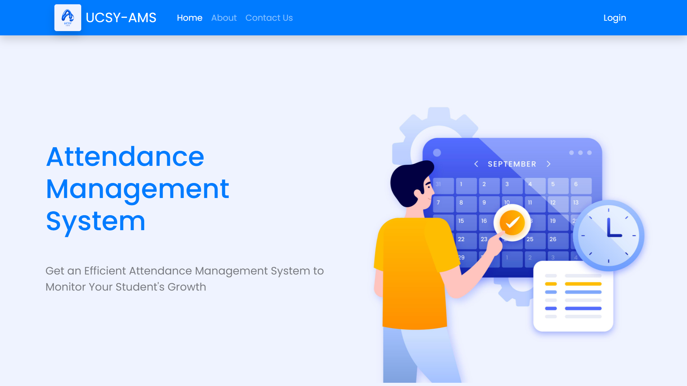

# 🕒 Attendance Management System (AMS)

A full-featured web-based Attendance Management System built for our University Final Year Project. It supports multiple user roles (Admin, Teachers, Class Roasters, Students) and simplifies the process of tracking, managing, and reporting student attendance.

---

## 🔑 Roles & Responsibilities

### 👤 Admin (My Role)
- Create, update, and manage all user roles
- Configure attendance rules and policies
- View and export attendance reports
- Send notifications to users

### 🎓 Student (My Role)
- Login to check in/out for classes
- View personal attendance history
- Receive announcements or warnings

> 🔄 Other roles like **Teachers** and **Class Roasters** were handled by the other team group.

---

## 🛠 Tech Stack

| Layer       | Technology |
|-------------|------------|
| Frontend    | HTML, CSS, JavaScript, Bootstrap |
| Backend     | Spring Boot |
| Database    | MySQL |
| Tools       | VS Code, GitHub |

---

## 📌 Key Features

- ✅ Role-based login and access control
- ✅ Daily attendance check-in/out with timestamps
- ✅ Real-time notifications
- ✅ Attendance history and reporting
- ✅ Responsive UI design

---

## 📷 Screenshots

*Home Page*
---

## 🚀 Getting Started

### ✅ Prerequisites

- Java 17 or above
- Maven 3.6+
- MySQL database

---

### 🔧 Setup Instructions

1. **Clone the repository**
   ```bash
   git clone https://github.com/your-username/attendance-management-system.git
   cd attendance-management-system

2. **Configure application.properties**
    spring.datasource.url=jdbc:mysql://localhost:3306/ams
    spring.datasource.username=root
    spring.datasource.password=yourpassword
    spring.jpa.hibernate.ddl-auto=update
    spring.jpa.show-sql=true

3. **Build the project**
   ```bash
   mvn clean install

4. **Run the application**
   ```bash
   mvn spring-boot:run
